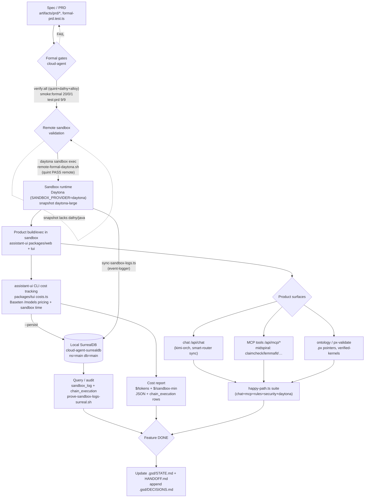

# Critical Path — Completing a Feature Across the Stack

**Owner repo:** `experiments/01-platform/cloud-agent` (platform / control plane)
**Product repo:** `experiments/02-products/assistant-ui`
**Updated:** 2026-07-21

This is the ordered, gated path a feature must traverse to be "done" across
cloud-agent formal validation → cloud sandboxes → assistant-ui CLI cost tracking →
local SurrealDB persistence → product surfaces (chat / MCP / ontology).

Each stage is a **gate**: it must be green (with attached evidence) before the next
stage is trusted. No stage may be marked PASS without raw tool output.

## Flow

## Ordered steps — "what must be true"

1. **Spec exists & typed.** PRD pack under `artifacts/prd/<feature>/` and the formal
   PRD contract tests pass: `npm run test:prd` → **9/9**.
2. **Local formal gates green.** `npm run verify:all` (quint + dafny + alloy; tla stub SKIP)
   and `npm run smoke:formal` (**20 PASS / 0 FAIL / 1 SKIP**; the SKIP is `DAFNY2JS_PATH`).
   Evidence lands in `.gsd/evidence/*-smoke-formal.md` / `*-verify-all.txt`.
3. **Remote sandbox validation.** A Daytona sandbox is STARTED and the formal slice runs
   remotely: `bash scripts/remote-formal-daytona.sh <SBX>` → **quint PASS** on the sandbox.
   (Dafny/Alloy remote require a snapshot with dafny+dotnet+java, e.g. `daytona-midspiral`;
   the default `daytona-large` is Node-only → those suites stay SKIP remotely, PASS locally.)
4. **Sandbox runtime healthy.** `SANDBOX_PROVIDER=daytona`, valid `DAYTONA_API_KEY` /
   `DAYTONA_ORGANIZATION_ID`, snapshot resolvable; `daytona sandbox exec <SBX> -- "…"` returns.
5. **Product builds/executes in sandbox.** assistant-ui `packages/web` (Next.js) + `packages/tui`
   run; happy-path infra checks reach web + orch + worker health.
6. **Cost tracking on.** `npm run costs:tui -- --live [--sandbox-seconds N --sandbox-id <SBX>]`
   emits token + sandbox cost lines using **live Baseten `/models` pricing** (never invented).
   `--persist` writes each LLM line to SurrealDB `chain_execution`.
7. **Logs persisted to local SurrealDB.** `./scripts/prove-sandbox-logs-surreal.sh <SBX>`
   writes real sandbox stdout to `sandbox_log` and reads it back (repo tool + raw query).
   Target: `cloud-agent-surrealdb` (`localhost:8000`, ns/db=`main`).
8. **Product surfaces validated.** `npm run happy` (assistant-ui) exercises chat (`/api/chat`),
   MCP tools (`/api/mcp/*`, midspiral claimcheck/lemmafit/kernel), rules, security, daytona.
9. **State updated.** `.gsd/STATE.md` + `.gsd/HANDOFF.md` refreshed; decision appended to
   `.gsd/DECISIONS.md`; gaps updated in `.gsd/gaps/tracking.md`.

## Gate → evidence map

| Gate | Command | Evidence |
|------|---------|----------|
| Formal PRD | `npm run test:prd` | stdout 9/9 |
| Local formal | `npm run verify:all` / `smoke:formal` | `.gsd/evidence/*-verify-all.txt`, `*-smoke-formal.md` |
| Remote formal | `scripts/remote-formal-daytona.sh` | `.gsd/evidence/*-cloud-agent-sandbox-formal.txt` |
| Cost tracking | `costs:tui -- --live` | `.gsd/evidence/20260721-tui-cost-*` (+ mirror) |
| Surreal logs | `scripts/prove-sandbox-logs-surreal.sh` | `.gsd/evidence/*-prove-sandbox-logs-surreal.txt` |
| Product surfaces | assistant-ui `npm run happy` | happy-path stdout |

## Known blockers on the path

- **Remote dafny/alloy/tla**: default snapshot Node-only → SKIP remotely (PASS locally).
- **`DAFNY2JS_PATH` unset** → live `POST /api/verify/dafny2js` SKIP in smoke.
- **SurrealDB IPv4/IPv6 split**: `localhost`→IPv6 docker container (intended); a separate host
  `surreal` on `127.0.0.1` is unrelated. Query the container via `http://[::1]:8000`.
- **Daytona preview SSE** can deliver 0 events through the proxy; treat empty event files as a
  proxy limitation, not "no work."
- **Parallel agents on assistant-ui** may reset/clean the tree; keep durable copies of platform
  deliverables in `cloud-agent/.gsd/` (this repo is the safe source of truth).
