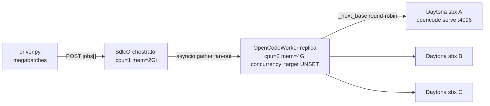

# Cost Efficiency (Packing) + Image Improvements

**Date:** 2026-07-21  
**Scope:** Analysis and recommendations only — no code changes in this pass.  
**Target:** Baseten Chains (`SdlcOrchestrator` → `OpenCodeWorker`) + Daytona sandboxes running `opencode serve`.

---

## 1. Executive summary

Two levers cut cost in this architecture, and they compound:

| Lever | What it changes | Expected savings direction |
|-------|-----------------|----------------------------|
| **A. Packing** | Many concurrent I/O-bound jobs onto **one** `OpenCodeWorker` replica via Baseten `concurrency_target` / `target_utilization` | Fewer worker replicas (chainlet compute $/min) |
| **B. Custom Daytona snapshot** | Bake formal toolchains + `opencode` into the image; normalize auto-stop | Shorter sandbox lifetimes (Daytona $/min) and less cold-start waste |

Faster jobs (B) mean fewer sandbox-minutes per job; packing (A) means those jobs do not force extra Baseten replicas. LLM token cost is largely independent of packing — optimize prompts/iterations separately.

**Prerequisite for safe packing today:** keep `#sandboxes ≥ #concurrent jobs`. Jobs share a hardcoded `repo/` path per sandbox; oversubscribing a sandbox causes filesystem collisions (see §8).

---

## 2. Current architecture + cost model

### Code anchors

| Piece | Location |
|-------|----------|
| Orchestrator fan-out | [`pybatch/src/sdlc_batch/sdlc_chain.py`](../pybatch/src/sdlc_batch/sdlc_chain.py) ~1143–1149 (`asyncio.create_task` + `gather`) |
| Worker `RemoteConfig` (no concurrency knobs) | same file ~281–300 |
| Round-robin sandbox selection | `_next_base()` ~339–343; `OPENCODE_SANDBOX_IDS` 1:1 with `OPENCODE_BASE_URLS` |
| httpx pool | ~325–333: HTTP/2, `max_connections=256`, `max_keepalive=128`, `keepalive_expiry=60`, `read=1200` |
| Megabatch knobs | [`pybatch/src/sdlc_batch/driver.py`](../pybatch/src/sdlc_batch/driver.py): `JOBS_PER_MEGABATCH` (default 64), `MAX_PARALLEL_MEGABATCHES` (default 8) |
| Daytona create / OpenCode boot | [`pybatch/src/sdlc_batch/providers/daytona.py`](../pybatch/src/sdlc_batch/providers/daytona.py): snapshot `daytona-large`, `auto_stop_interval=0`, runtime `_write_opencode_config` + `_start_opencode` |
| Disk / wave limits | [`docs/sdlc-batch-scaling.md`](sdlc-batch-scaling.md) (~300 GiB org quota) |
| Cost harness | [`.gsd/evidence/tui-cost-tracking/cost-tracker.ts`](../.gsd/evidence/tui-cost-tracking/cost-tracker.ts) |
| Remote formal SKIP gaps | [`.gsd/STATE.md`](../.gsd/STATE.md) (dafny/alloy/tla SKIP on Node-only snapshot) |

### What is billed

| Layer | Unit | Notes |
|-------|------|--------|
| Baseten Chainlet replicas | Compute SKU $/min | Orchestrator + worker; scales with replica count |
| Daytona sandboxes | $/min (env-gated in tracker as `AUI_COST_DAYTONA_USD_PER_MIN`) | Dominant continuous cost for batch waves |
| LLM tokens | $/token from Baseten `/models` | Tracked via `CostTracker.recordLLM` |

### Amortized sandbox cost (motivation for reuse + cold-start cuts)

\[
\text{cost\_per\_job} \approx \frac{C \times (T_{\text{cold}} + \sum_i T_{\text{runtime},i} + T_{\text{idle}})}{N}
\]

where \(C\) is sandbox rate per second, \(N\) is jobs served by one sandbox lifetime. Cutting \(T_{\text{cold}}\) (custom snapshot) and \(T_{\text{idle}}\) (auto-stop) lowers per-job cost even when \(N = 1\).

---

## 3. Why packing is safe here (I/O-bound framing)

On the Baseten worker, wall-clock time is dominated by:

1. Daytona `process.exec` / shell validation  
2. HTTP calls to `opencode serve` (session + messages)  
3. Downstream LLM latency inside the sandbox  

Local CPU work (JSON parse, patch apply orchestration) is modest. That makes the worker **I/O-bound**.

Baseten’s dedicated autoscaler does **not** use GPU/CPU utilization. It samples in-flight request slots over `autoscaling_window` (default 60s) relative to `concurrency_target × target_utilization` ([Autoscaling overview](https://docs.baseten.co/deployment/autoscaling/overview)). Routing prefers the least-utilized replica by slot fullness ([Request lifecycle](https://docs.baseten.co/deployment/autoscaling/request-lifecycle)).

Therefore a single worker replica can host many concurrent `run_remote` / internal fan-out tasks **if** concurrency is configured high enough that the autoscaler does not interpret “many in-flight slots” as “need more replicas.”

---

## 4. Packing recommendations (cut chainlet replica cost)

### Autoscaler math

\[
\text{desired\_replicas} = \left\lceil \frac{\text{in\_flight}}{\text{concurrency\_target} \times \text{target\_utilization}} \right\rceil
\]

Scale-up when:

\[
\text{load} > \text{replicas} \times \text{concurrency\_target} \times \text{target\_utilization}
\]

### Worked example

| Config | Effective capacity per replica | 200 in-flight jobs → replicas |
|--------|-------------------------------|-------------------------------|
| `concurrency_target=256`, `target_utilization=0.8` | \(256 × 0.8 = 204.8\) | \(\lceil 200/204.8 \rceil = 1\) |
| `concurrency_target=256`, `target_utilization=0.5` | \(128\) | \(\lceil 200/128 \rceil = 2\) |

Same I/O-bound work; lower utilization doubles worker replica cost with no throughput benefit.

### Recommended starting values (`OpenCodeWorker`)

| Knob | Start | Rationale |
|------|-------|-----------|
| `concurrency_target` | **256** | Align with existing httpx `max_connections=256` in `sdlc_chain.py` |
| `target_utilization` | **0.8** | Pack I/O-bound work; avoid premature scale-out (contrast with older batch-loop note of 40–50%, which favors headroom over cost) |
| `min_replicas` | **1** | Avoid Baseten cold start during active batches |
| `max_replicas` | **2** | Cost guardrail for misconfig / spikes |
| Runtime concurrency (`predict_concurrency` / Chains analogue) | **≥ 256** | Runtime must accept what the autoscaler thinks capacity is ([Truss configuration](https://docs.baseten.co/reference/truss-configuration)) |

**Gap today:** `OpenCodeWorker.remote_config` (~281–300) sets only `docker_image`, `compute`, and `assets` — no concurrency knobs. Defaults will tend to add replicas instead of packing.

### Megabatch / driver alignment

In [`driver.py`](../pybatch/src/sdlc_batch/driver.py):

- Default `JOBS_PER_MEGABATCH=64`, `MAX_PARALLEL_MEGABATCHES=8` → at most **8** concurrent HTTP posts to the chain entrypoint (coarse-grained from the autoscaler’s view of the **orchestrator**).
- Inside one megabatch, the orchestrator fans out jobs to the worker with `asyncio.gather` — that is the packing surface for the **worker**.

Recommendations:

- Prefer megabatches that fill worker capacity without oversubscribing sandboxes (see §8): e.g. jobs per wave ≈ sandbox pool size.
- For deployed Chains, keep `MAX_PARALLEL_MEGABATCHES` low enough that orchestrator in-flight count stays near 1–few replicas.
- Batch sizes in the **100–150** range are a research-backed starting band when worker concurrency is high; today disk/quota and the 1:1 sandbox rule usually dominate before that.

Existing tuning notes: [`docs/batch-loop/README — deployment + tuning notes.md`](batch-loop/README%20—%20deployment%20+%20tuning%20notes.md) and [`docs/sdlc-batch-scaling.md`](sdlc-batch-scaling.md) (`SDLC_WAVE_SIZE`, `SDLC_SANDBOX_COUNT`).

### Compute right-sizing

| Chainlet | Current | Guidance |
|----------|---------|----------|
| Orchestrator | `cpu=1`, `memory=2Gi` | Keep small; CPU-light validation/orchestration ([Resources](https://docs.baseten.co/deployment/resources)) |
| Worker | `cpu=2`, `memory=4Gi` | CPU often fine for I/O-bound fan-out; watch **memory** under large httpx pools / response buffers (research suggests `4x16`-class if OOM or thrash appears). GPU unnecessary. |

### Long-run caveat (20-minute sync edge)

Worker httpx `read=1200` (20 minutes) sits at Baseten’s synchronous ingress edge. For SDLC loops that may exceed that:

- Prefer `async_run_remote` + webhook ([Async inference](https://docs.baseten.co/inference/async)), already mentioned in the batch-loop README.

---

## 5. httpx.AsyncClient tuning + failure playbook

Baseten recommends httpx with connection pooling and optional HTTP/2 for high-throughput clients ([HTTP client configuration](https://docs.baseten.co/inference/http-client-configuration)). Official httpx docs: [python-httpx.org](https://www.python-httpx.org/).

### Current vs recommended

| Parameter | Current (`sdlc_chain.py` ~325–333) | Recommended |
|-----------|-------------------------------------|-------------|
| `max_connections` | 256 | Keep 256 (or raise with host count) |
| `max_keepalive_connections` | 128 | Keep 128 |
| `keepalive_expiry` | **60** s | **~30** s — close idle clients before server drops; avoid stale connections |
| `Timeout.connect` | 10 s | Keep or ~5 s for fail-fast |
| `Timeout.read` | 1200 s | Keep intentional for long verify/LLM; pair with async entrypoint for >20 min |
| `Timeout.write` | 30 s | Keep |
| `Timeout.pool` | 10 s | Keep or ~5 s; treat `PoolTimeout` as capacity signal |
| HTTP/2 | Enabled | Keep |

### Multi-host guidance

The worker pool talks to **N** distinct sandbox preview hosts (`OPENCODE_BASE_URLS`). Options:

1. Scale `max_connections` roughly with N × per-host concurrency, or  
2. Use **per-host** `AsyncClient` instances to reduce cross-host head-of-line blocking.

Reserve a separate client/pool for the longest-lived streams if short validation execs share the pool with multi-minute LLM turns.

### Error playbook

| Error | Meaning | Action |
|-------|---------|--------|
| `PoolTimeout` | Pool exhausted | Raise `max_connections` / keepalive, or **lower** concurrency — do not blind-retry |
| `ConnectTimeout` | TCP/TLS failed | Check sandbox auto-stop / preview URL expiry / network; retry only transient cases with backoff + jitter |
| `ReadTimeout` | No bytes within read timeout | Raise read timeout, shorten job, or move to async webhook pattern |
| HTTP 4xx | Client/auth error | Do **not** retry; fix tokens / payload |

**Autoscaler feedback loop:** connection thrashing → higher latency → more in-flight slots over the window → **spurious scale-up**. Stable pools are a cost control, not only a latency control.

---

## 6. Daytona snapshot image improvements

### Problem

- Default snapshot: `daytona-large` (Node-oriented).  
- Remote formal evidence: quint may pass; **dafny / alloy / tla SKIP** ([`.gsd/STATE.md`](../.gsd/STATE.md)).  
- Runtime cost: [`DaytonaProvider`](../pybatch/src/sdlc_batch/providers/daytona.py) writes `~/.config/opencode/opencode.json` and starts `opencode serve` after create; tools may be installed via npm/apt per session.  
- Host tooling pins (for baking): [`scripts/setup-verification-tools.sh`](../scripts/setup-verification-tools.sh) — TLA+ `tla2tools.jar` v1.7.4, Alloy 6.2.0, Quint `@informalsystems/quint@0.32.0`, Dafny via brew/manual.

### Target: custom snapshot + warm pool

Use Daytona’s **Declarative Image Builder** / snapshot workflow so warm sandboxes already contain:

| Component | Placement / notes |
|-----------|-------------------|
| Dafny + .NET runtime | `/opt/dafny` (or distro path), on `PATH` |
| Quint | Global npm pin `0.32.0` |
| Alloy | `/opt/alloy/alloy.jar` (v6.2.0) |
| TLA+ | `/opt/tla/tla2tools.jar` (v1.7.4) + JRE |
| git | Required for clone/PR path |
| `opencode` binary | Preinstalled; prefer serve on boot |
| `opencode.json` | Pre-baked proxy provider config (same shape as `_write_opencode_config`) |

Shared toolchains under `/opt/...` (read-only for jobs) reduce disk duplication against the ~300 GiB org quota.

### Amortized cold-start example

If cold start drops from ~60s to ~10s and one sandbox serves \(N\) jobs:

\[
\frac{T_{\text{cold}}}{N}:\quad \frac{60}{N} \rightarrow \frac{10}{N}\ \text{seconds billed per job}
\]

Warm pools further remove cold start from the critical path when demand is bursty ([Daytona warm-pool / declarative image practice](https://x.com/ivanburazin/highlights); isolation comparison [Daytona vs E2B](https://northflank.com/blog/daytona-vs-e2b-ai-code-execution-sandboxes)).

### Normalize idle policy

| Surface | Current | Recommendation |
|---------|---------|----------------|
| Python `DaytonaProvider.create_sandbox` | `auto_stop_interval=0` (never) + `auto_pause=True` | Explicit auto-stop **15–30 min** for batch fleets |
| TS scripts (`expand-web-formal-daytona.ts`, `moonlit-fiddle-daytona.ts`) | `autoStopInterval` 60–90 | Align with provider (pick one policy) |

Idle sandboxes dominate $/min when waves finish but boxes stay up. E2B’s per-second model underscores the same lesson even if Daytona is primary ([E2B pricing](https://e2b.dev/pricing)).

`opencode serve` reference: [opencode.ai/docs/server](https://opencode.ai/docs/server/).

---

## 7. Baseten Chainlet image improvements

| Chainlet | Current image | Recommendation |
|----------|---------------|----------------|
| `OpenCodeWorker` | `pip_requirements`: `httpx[http2]>=0.27`, `pydantic>=2`, `pyyaml>=6.0`, `daytona>=0.14.0` | **Pin exact versions** for reproducible, faster cold starts |
| `SdlcOrchestrator` | `pydantic>=2` only | Keep minimal; pin version |

Also:

- `min_replicas=1` on both Chainlets during active batch windows (idle cost vs cold-start latency trade-off).  
- Pair with `max_replicas` guardrail from §4.  
- Confirm health / `streaming_read_timeout` settings match long-running SDLC calls ([Truss configuration](https://docs.baseten.co/reference/truss-configuration)).

---

## 8. Safe multiplexing / correctness guardrail

### Risk

In `OpenCodeWorker.run_remote`:

1. Job is assigned a base URL via `_next_base()` (round-robin).  
2. Repo is cloned into a hardcoded **`repo/`** directory.  
3. Orchestrator runs many jobs concurrently via `asyncio.gather`.

If **`#concurrent jobs > #sandboxes`**, two jobs can land on the same sandbox and fight over `repo/` (checkout clobber, mixed diffs, contaminated formal specs, failed PRs). Research and Daytona worktree discussions agree: concurrent jobs must not share one working tree ([Sandbox Worktrees](https://github.com/daytonaio/daytona/issues/3707)).

### Operational rule (no code change required)

\[
\#\text{sandboxes} \ge \#\text{concurrent jobs}
\]

i.e. 1:1 sandbox-to-in-flight-job for the current design. Cap waves with `SDLC_WAVE_SIZE` / `SDLC_SANDBOX_COUNT` accordingly ([sdlc-batch-scaling.md](sdlc-batch-scaling.md)).

### Future code fix (out of scope here)

Per-job isolation unlocks packing that also **reduces sandbox count**:

1. Per-job directories: `/workspace/job-<id>/`  
2. Git worktrees sharing one object store  
3. Daytona Sandbox Worktrees (separate containers per branch)

Until then, packing reduces **worker replica** cost, not Daytona box count.

---

## 9. Measurement / A-B methodology

### Harness

[`CostTracker`](../.gsd/evidence/tui-cost-tracking/cost-tracker.ts):

- `recordLLM` — tokens priced from Baseten `/models` (never invent prices).  
- `recordSandbox` — seconds × `AUI_COST_DAYTONA_USD_PER_MIN` (unset → unpriced sandbox line).  
- Optional persist to SurrealDB `chain_execution`.

### Metrics (before / after)

| Metric | Why |
|--------|-----|
| LLM tokens in/out + $ | Model cost |
| Sandbox seconds + $ | Dominant infra cost |
| Cost / job | Primary success metric |
| Worker p99 latency | Packing health |
| `PoolTimeout` / `ReadTimeout` rate | Client capacity |
| Baseten replica count over window | Packing success |
| Formal SKIP rate (dafny/alloy/tla) | Snapshot success |

### A/B arms

| Arm | Config |
|-----|--------|
| **A — Baseline** | Current: unset worker concurrency, `daytona-large`, `keepalive_expiry=60`, provider `auto_stop_interval=0` |
| **B — Packed + image** | `concurrency_target=256`, `target_utilization=0.8`, `min_replicas=1`, `max_replicas=2`, `keepalive_expiry=30`, custom formal snapshot, auto-stop 15–30 min |

Run the **same** jobs file (e.g. an existing `pybatch/jobs-*.json`) under both arms, multiple trials. Confounders: LLM variance, GitHub rate limits, ngrok/proxy health, sandbox disk pressure.

---

## 10. Prioritized recommendations

| Priority | Action | Effort | Impact | Risk |
|----------|--------|--------|--------|------|
| **P0** | Enforce `#sandboxes ≥ #concurrent jobs` in runbooks / wave sizing | Low | Correctness | Blocking for safe packing |
| **P1** | Set worker `concurrency_target=256`, `target_utilization=0.8`, `min_replicas=1`, `max_replicas=2` (+ runtime concurrency) | Low | High (replica $) | Mis-set util too low → extra replicas |
| **P1** | Lower httpx `keepalive_expiry` to ~30s | Low | Medium (stability → less spurious scale-up) | Low |
| **P2** | Pin Chainlet `pip_requirements`; keep orchestrator minimal | Low | Medium (cold start) | Low |
| **P2** | Normalize Daytona auto-stop (15–30 min) across Python + TS | Low–Med | High (idle $/min) | Jobs interrupted if stop too aggressive |
| **P3** | Custom Daytona snapshot (dafny, quint, alloy, tla, opencode + config) | High | High (cold start + formal SKIP) | Image maintenance |
| **P4** | Per-job worktree / Sandbox Worktrees | High | High (sandbox count ↓) | Correctness if half-done |
| **P4** | Async entrypoint for >20 min loops | Med | Medium | Ops/webhook complexity |

### Follow-ups (explicitly not done in this pass)

- Code changes to `sdlc_chain.py` `RemoteConfig`  
- Snapshot Dockerfile / Declarative Image build pipeline  
- Per-job directory isolation  
- Switching production batches to `async_run_remote`

---

## References

### Upstream

- [Baseten Autoscaling](https://docs.baseten.co/deployment/autoscaling/overview)  
- [Baseten Request lifecycle](https://docs.baseten.co/deployment/autoscaling/request-lifecycle)  
- [Baseten Resources](https://docs.baseten.co/deployment/resources)  
- [Baseten HTTP client configuration](https://docs.baseten.co/inference/http-client-configuration)  
- [Baseten Truss configuration](https://docs.baseten.co/reference/truss-configuration)  
- [Baseten Async inference](https://docs.baseten.co/inference/async)  
- [Baseten Chains explained](https://www.baseten.co/blog/baseten-chains-explained/)  
- [httpx](https://www.python-httpx.org/)  
- [opencode serve](https://opencode.ai/docs/server/)  
- [Daytona vs E2B](https://northflank.com/blog/daytona-vs-e2b-ai-code-execution-sandboxes)  
- [Daytona Sandbox Worktrees](https://github.com/daytonaio/daytona/issues/3707)  
- [E2B pricing](https://e2b.dev/pricing)

### In-repo

- [`pybatch/src/sdlc_batch/sdlc_chain.py`](../pybatch/src/sdlc_batch/sdlc_chain.py)  
- [`pybatch/src/sdlc_batch/driver.py`](../pybatch/src/sdlc_batch/driver.py)  
- [`pybatch/src/sdlc_batch/providers/daytona.py`](../pybatch/src/sdlc_batch/providers/daytona.py)  
- [`scripts/setup-verification-tools.sh`](../scripts/setup-verification-tools.sh)  
- [`docs/sdlc-batch-scaling.md`](sdlc-batch-scaling.md)  
- [`docs/batch-loop/README — deployment + tuning notes.md`](batch-loop/README%20—%20deployment%20+%20tuning%20notes.md)  
- [`.gsd/STATE.md`](../.gsd/STATE.md)  
- [`.gsd/evidence/tui-cost-tracking/cost-tracker.ts`](../.gsd/evidence/tui-cost-tracking/cost-tracker.ts)
